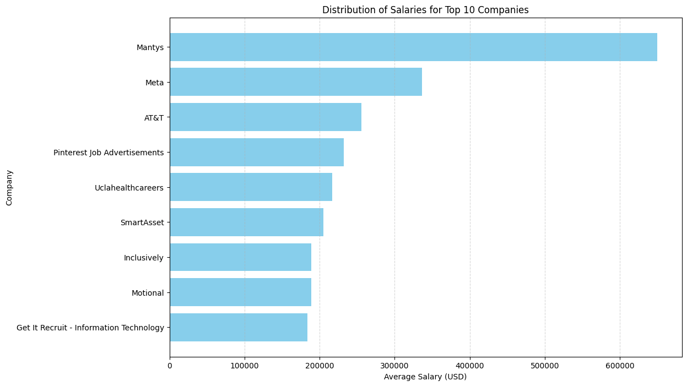
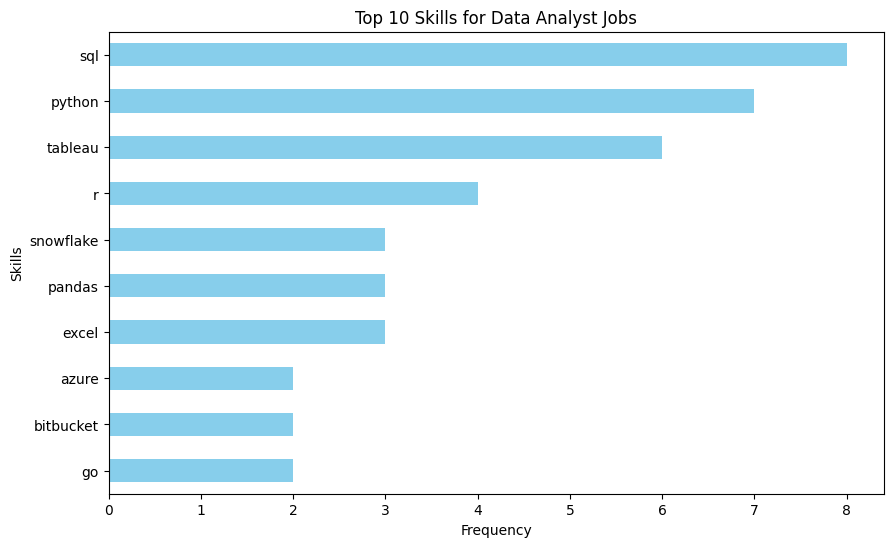
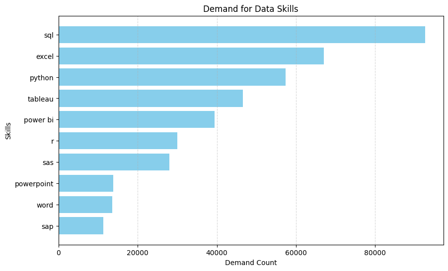
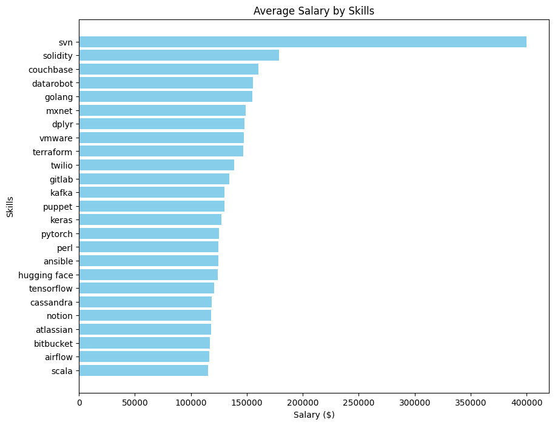
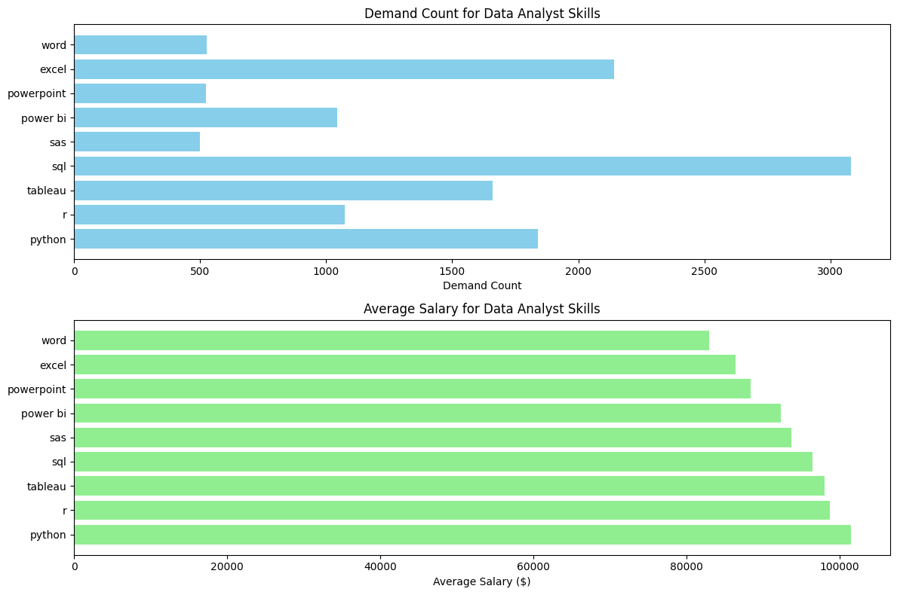

# Introduction
Following the tutorial [@lukebarousse](https://github.com/lukebarousse) has made (Link to the tutorial below!! Really helps out as a beginner), I learned about the basic, intermediate, and advanced SQL skills to build a project where I analyze the top-paying jobs, demanding skills for the jobs, and the high demanded jobs with high salaries in data analytics field. I was able to download the csvs for the analyzed sql queries, and provide an insight about the job market as a whole as I went through the tutorial.


Check the SQL queries out here : [project_sql folder](/project_sql/)


Luke's SQL for Data Analytics Course : [Youtube Link](https://www.youtube.com/watch?v=7mz73uXD9DA)


# Background
In order to understand about the Data Analyst's job market effectively, this project focuses on analyzing the top-paid jobs/companies and in-demand skills to find the optimal job for Data Analyst.

Datasets were downloaded from Luke's Google Drive Folder : [CSV Files for the Project](https://drive.google.com/drive/folders/1moeWYoUtUklJO6NJdWo9OV8zWjRn0rjN)


## The questions I answered through the SQL queries : 
1. What are the top paying data analyst jobs and their companies?
2. What skills are required for these top-paying jobs?
3. What skills are most in demand for data analysts?
4. Which skills are associated with higher salaries?
5. What are the most optimal skills to learn?

# Tools I used

- **SQL :** Allowed me to query the database that led me to create insights
- **PostgreSQL :** Database Management system that I used to handle the job posting data
- **Python (Pandas and Matplotlib) :** Used to visualize the data result created using SQL
- **Visual Studio Code :** Data Management and Execution of SQL queries
- **Google Colab :** Used to run the visualization code written in Python
- **Git & Github :** Version controlling and sharing my SQL code and analysis with project tracking

#The Analysis
I used the SQL queries to investigate and answer specific questions about the Data Analyst job market. These are the procedures : 

<br>

### 1. Top Paying Jobs (Data Analyst) Companies
In order to identify the highest paying roles for Data Analyst jobs, I filtered the data analyst positions by average yearly salary and location focusing mainly on the remote jobs (Where the location = 'Anywhere'). This SQL query highlights the description above : 

```sql
SELECT 
    companies.name,
    jobs.job_title_short,
    jobs.salary_year_avg


FROM job_postings_fact AS jobs
LEFT JOIN company_dim AS companies ON jobs.company_id = companies.company_id

WHERE 
    jobs.salary_year_avg IS NOT NULL
    AND jobs.job_location = 'Anywhere'
    AND jobs.job_title_short = 'Data Analyst'

ORDER BY jobs.salary_year_avg DESC

LIMIT 20;
```
Here are the insights of Data Analyst Jobs in companies in 2023 (Created Using ChatGPT): 

- **Diverse Employer Range:** Data Analyst roles are sought after by a wide array of employers, spanning tech giants like Meta (formerly Facebook) and Uber, healthcare institutions like Mayo Clinic, and telecommunications companies such as AT&T and DIRECTV.

- **Salary Variation:** Salaries for Data Analyst positions vary significantly, ranging from around $160,000 to $650,000 per year. This range underscores the influence of factors like company size, location, and specific skill requirements on compensation packages.

- **Consistent Demand:** The presence of multiple job postings and advertisements for Data Analyst roles indicates a sustained demand for professionals with data analysis skills across various industries, highlighting the role's importance in contemporary business operations.

<br>

In order to understand the analytical results above, I have create the visualization for it using Python and Google Colab : 

```python
import pandas as pd
import matplotlib.pyplot as plt

data = pd.read_csv('top_paying_companies.csv')

df = pd.DataFrame(data)

top_10_companies = df.sort_values(by='salary_year_avg', ascending=False).head(10)

plt.figure(figsize=(12, 8))
plt.barh(top_10_companies['name'], top_10_companies['salary_year_avg'], color='skyblue')
plt.xlabel('Average Salary (USD)')
plt.ylabel('Company')
plt.title('Distribution of Salaries for Top 10 Companies')
plt.gca().invert_yaxis()  # Invert y-axis to display highest salary at the top
plt.grid(axis='x', linestyle='--', alpha=0.5)  # Add gridlines
plt.show()
```


*Bar graph visualizing the top 10 companies paying the most for Data Analyst roles*

<br>

### 2. Top paying skills as a Data Analyst

In order to identify the highest paying skills for Data Analyst jobs, I joined the job posting data with the skills data, investing what skills are valueable for Data Analyst roles. 

```sql
WITH top_paying_jobs AS (
SELECT 
    companies.name AS company_name,
    jobs.job_title_short AS job_name,
    jobs.salary_year_avg AS salary_average,
    jobs.job_id

FROM job_postings_fact AS jobs
LEFT JOIN company_dim AS companies ON jobs.company_id = companies.company_id

WHERE 
    jobs.salary_year_avg IS NOT NULL
    AND jobs.job_location = 'Anywhere'
    AND jobs.job_title_short = 'Data Analyst'

ORDER BY jobs.salary_year_avg DESC
LIMIT 10

)


SELECT
    top_paying_jobs.job_id,
    top_paying_jobs.company_name,
    top_paying_jobs.job_name,
    top_paying_jobs.salary_average,
    skills_dim.skills
    
FROM top_paying_jobs 

LEFT JOIN skills_job_dim ON skills_job_dim.job_id = top_paying_jobs.job_id
LEFT JOIN skills_dim ON skills_job_dim.skill_id = skills_dim.skill_id
WHERE skills_dim.skills IS NOT NULL;
```
Here are the insights of the skills for Data Analyst Jobs in 2023 (Created using Chat GPT): 

- **Diverse Skill Set:** The top 10 skills for Data Analyst roles in 2023 showcase a diverse range of technical proficiencies, including SQL, Python, R, Azure, Databricks, AWS, Pandas, PySpark, Jupyter, and Excel. This indicates the multifaceted nature of the role, requiring expertise in various tools and programming languages to perform data analysis tasks effectively.

- **Emphasis on Data Manipulation and Analysis:** Skills such as SQL, Python, Pandas, and PySpark highlight the importance of data manipulation and analysis in Data Analyst positions. These skills enable professionals to extract, clean, transform, and analyze data from diverse sources to derive meaningful insights for decision-making purposes.

- **Tools for Visualization and Presentation:** In addition to data analysis, proficiency in tools like Excel, Jupyter, and visualization platforms like Tableau may be crucial for Data Analysts. These skills facilitate the visualization and presentation of data findings, aiding in the communication of insights to stakeholders effectively.

<br>

Visualization using Python:

```python
import pandas as pd
import matplotlib.pyplot as plt

data = pd.read_csv('top_paying_job_skills.csv')

skill_counts = data['skills'].value_counts()

top_10_skills = skill_counts.head(10)

plt.figure(figsize=(10, 6))
top_10_skills.plot(kind='barh', color='skyblue')
plt.xlabel('Frequency')
plt.ylabel('Skills')
plt.title('Top 10 Skills for Data Analyst Jobs')
plt.gca().invert_yaxis()  
plt.show()
```


*Bar graph visualizing the top 10 skills for Data Analyst roles*

<br>

### 3. In-Demand Skills For Data Analytics

Here I counted the number of demanded skill for each job ids, and then compared how many job postings required each skills and determined the top 10 demanded skills:

```sql
SELECT 
    skills,
    COUNT(skills_job_dim.job_id) AS demand_count

FROM job_postings_fact

INNER JOIN skills_job_dim ON skills_job_dim.job_id = job_postings_fact.job_id
INNER JOIN skills_dim ON skills_job_dim.skill_id = skills_dim.skill_id

WHERE job_title_short = 'Data Analyst'

GROUP BY skills
ORDER BY demand_count DESC

LIMIT 10; 
```
Here are the insights of the demanded skills for Data Analyst Jobs in 2023 (Created using Chat GPT): 

- **SQL Dominates Data Skills Demand:** With a demand count of 92,628, SQL stands out as the most sought-after skill in the data domain. Its prevalence underscores its fundamental role in querying, managing, and analyzing structured data, highlighting its indispensability in data-related roles.

- **Strong Preference for Data Analysis Tools:** Skills like Excel, Python, Tableau, and Power BI feature prominently in the top-demand list. This emphasizes the importance of proficiency in data analysis tools for roles requiring data manipulation, visualization, and reporting tasks.

- **Emerging Importance of Programming Languages:** Python and R, with demand counts of 57,326 and 30,075 respectively, signify the growing significance of programming languages in the data landscape. These languages offer powerful capabilities for data analysis, machine learning, and statistical modeling, reflecting the evolving skill requirements in data-related professions.

<br>

Visualization using Python:

```python
import pandas as pd
import matplotlib.pyplot as plt

data = pd.read_csv('demanding_skills.csv')

df = pd.DataFrame(data)

plt.figure(figsize=(10, 6))
plt.barh(df['skills'], df['demand_count'], color='skyblue')
plt.xlabel('Demand Count')
plt.ylabel('Skills')
plt.title('Demand for Data Skills')
plt.gca().invert_yaxis()  

plt.grid(axis='x', linestyle='--', alpha=0.5)
plt.show()
```


*Bar graph visualizing the top 10 demanding skills for Data Analyst*

<br>

### 4. Skills Based on Salary

Similar to number 3, I joined the skills table to the job posting table. Regardless of the location, I analyzed the top paying skill sets of Data Analysts in 2023.

```sql
SELECT 
    skills_dim.skills AS skills,
    ROUND(AVG(job_postings_fact.salary_year_avg), 2) AS salary


FROM job_postings_fact


INNER JOIN skills_job_dim ON skills_job_dim.job_id = job_postings_fact.job_id
INNER JOIN skills_dim ON skills_dim.skill_id = skills_job_dim.skill_id


WHERE job_postings_fact.job_title_short = 'Data Analyst'
AND job_postings_fact.salary_year_avg IS NOT NULL

GROUP BY skills

ORDER BY salary DESC

LIMIT 25;
```
Here are the insights of the top paying skill sets for Data Analyst (Created using Chat GPT): 

- **High Salary for Specialized Skills:** Skills like SVN (Subversion) and Solidity command high salaries of $400,000 and $179,000 respectively. This suggests that expertise in specialized technologies or domains can lead to lucrative job opportunities with significantly higher compensation.

- **Popular Technologies with Competitive Salaries:** Technologies such as Golang, Dplyr, and Terraform offer competitive salaries ranging from $147,633 to $155,000. These skills are widely used in various industries, indicating a strong demand for professionals proficient in these technologies.

- **Deep Learning Frameworks in Demand:** PyTorch and TensorFlow, popular deep learning frameworks, offer salaries of $125,226 and $120,646 respectively. The demand for expertise in these frameworks reflects the increasing adoption of artificial intelligence and machine learning technologies across industries. Professionals skilled in these areas are likely to find abundant job opportunities and competitive compensation packages.

<br>

Visualization using Python:

```python
import pandas as pd
import matplotlib.pyplot as plt

data = pd.read_csv('skills_salary.csv')

skills = data['skills']
salaries = data['salary'].astype(float)

plt.figure(figsize=(10, 8))
plt.barh(skills, salaries, color='skyblue')
plt.xlabel('Salary ($)')
plt.ylabel('Skills')
plt.title('Average Salary by Skills')
plt.gca().invert_yaxis()  
plt.show()
```


*Bar graph visualizing the top 25 skills with high salary rate*

<br>

### 5. Optimal Skills
This time, I analyzed top 10 skills that are in high demand and has a high salary rate in 2023's Data Analyst job market.


```sql
WITH skills_demand AS (
    SELECT 
        skills_job_dim.skill_id,
        skills_dim.skills,
        COUNT(skills_job_dim.job_id) AS demand_count
    FROM 
        job_postings_fact
    INNER JOIN 
        skills_job_dim ON skills_job_dim.job_id = job_postings_fact.job_id
    INNER JOIN 
        skills_dim ON skills_dim.skill_id = skills_job_dim.skill_id
    WHERE 
        job_title_short = 'Data Analyst'
        AND job_postings_fact.salary_year_avg IS NOT NULL
    GROUP BY 
        skills_job_dim.skill_id,
        skills_dim.skills
),
average_salary AS (
    SELECT 
        skills_job_dim.skill_id,
        ROUND(AVG(job_postings_fact.salary_year_avg), 2) AS average_salary_skill
    FROM 
        job_postings_fact
    INNER JOIN 
        skills_job_dim ON skills_job_dim.job_id = job_postings_fact.job_id
    WHERE 
        job_postings_fact.job_title_short = 'Data Analyst'
        AND job_postings_fact.salary_year_avg IS NOT NULL
    GROUP BY 
        skills_job_dim.skill_id
)

SELECT 
    sd.skill_id,
    sd.skills,
    sd.demand_count,
    asr.average_salary_skill
FROM 
    skills_demand sd
INNER JOIN 
    average_salary asr ON asr.skill_id = sd.skill_id
WHERE
    demand_count BETWEEN 500 AND 3090

ORDER BY asr.average_salary_skill DESC
LIMIT 10; 
```
Here are the insights of the top paying and high demanding skill sets for Data Analyst (Created using Chat GPT): 

- **Python is the Most In-Demand Skill:** With a demand count of 1840, Python emerges as the most sought-after skill among Data Analyst roles. Despite its high demand, it also offers a competitive average salary of $101,511.85.

- **SQL Skills Command High Salaries:** While SQL has the highest demand count of 3083, it still maintains a respectable average salary of $96,435.33, indicating its significance in the Data Analyst role and its value in the job market.

- **Visualization Tools Are Essential:** Tableau, Power BI, and Excel are crucial visualization tools for Data Analysts, as indicated by their demand counts and average salaries. These skills, essential for analyzing and presenting data effectively, are highly sought after, with average salaries ranging from $86,418.90 to $97,978.08.

<br>

Visualization using Python:

```python
import pandas as pd
import matplotlib.pyplot as plt

data = pd.read_csv('optimal_skills.csv')

skills = data['skills']
demand_count = data['demand_count'].astype(int)
average_salary = data['average_salary_skill'].astype(float)

plt.figure(figsize=(12, 8))

plt.subplot(2, 1, 1)
plt.barh(skills, demand_count, color='skyblue')
plt.xlabel('Demand Count')
plt.title('Demand Count for Data Analyst Skills')

plt.subplot(2, 1, 2)
plt.barh(skills, average_salary, color='lightgreen')
plt.xlabel('Average Salary ($)')
plt.title('Average Salary for Data Analyst Skills')

plt.tight_layout()
plt.show()
```


*Bar graph visualizing data analyst skills that are both high demanding and contains high salary rate*

# What I Learned
As this is my first Data Analysis project using SQL and Python knowledge I have obtained from Luke's course and other sources, I have learned about these specific skill sets : 

- **Dealing with Complex Query Crafting:** Using advanced SQL methods, I have merged different table together. I also made it easier to merge using features such as CTEs.

- **Data Aggregation:** Used aggregate functions such as COUNT() and AVG() to use GROUP BY for summarization

- **Effect of Visualization:** Using Python, it was easy to interpret the results and the insights of the SQL query that I have analyzed. 

<br>

# Conclusions
## Main Insights

1. Diverse Employer Range: Data Analyst roles attract interest from a broad spectrum of employers, including tech giants like Meta and Uber, as well as healthcare institutions such as Mayo Clinic and telecommunications companies like AT&T and DIRECTV.

2. Variation in Salaries: Salaries for Data Analyst positions exhibit a wide range, from approximately $160,000 to $650,000 per year. This variability underscores the influence of factors like company size, location, and specific skill requirements on compensation packages.

3. Consistent Demand: The presence of numerous job postings and advertisements for Data Analyst roles indicates sustained demand for professionals with data analysis skills across diverse industries, underscoring the role's significance in contemporary business operations.

4. Emphasis on Data Skills: The top 10 skills for Data Analyst roles in 2023 reflect a diverse set of technical proficiencies, emphasizing data manipulation and analysis tools like SQL, Python, Pandas, and PySpark, alongside visualization and presentation tools such as Excel, Jupyter, and Tableau.

5. High Demand for Specialized Expertise: Skills like Python, SQL, and visualization tools like Tableau and Power BI emerge as highly sought after, with competitive salaries reflecting the growing importance of data analysis, manipulation, visualization, and presentation capabilities in Data Analyst roles.

<br>

# Closing Thoughts
Embarking on my inaugural data analytics journey, I owe a debt of gratitude to [@lukebarousse](https://github.com/lukebarousse) for his exceptional lecture on SQL. His guidance illuminated the path to applying SQL in real-world scenarios, igniting my passion for data analysis. Through this project, I delved into the exhilarating realm of data analytics, unraveling insights that shape business decisions.

Discovering the intricacies of SQL opened my eyes to the profound impact of data analytics. With each query, I uncovered valuable insights, witnessing firsthand the power of data to drive informed decisions. This journey has not only enriched my understanding of data analytics but has also instilled in me a profound appreciation for its significance in today's data-driven world.

As I reflect on this transformative experience, I am inspired to continue honing my skills as a Data Analyst/Scientist. Armed with newfound knowledge and fueled by curiosity, I eagerly anticipate delving into future projects that will further sharpen my analytical prowess. With each dataset, I embark on a voyage of discovery, driven by the pursuit of knowledge and the quest to unlock actionable insights.
